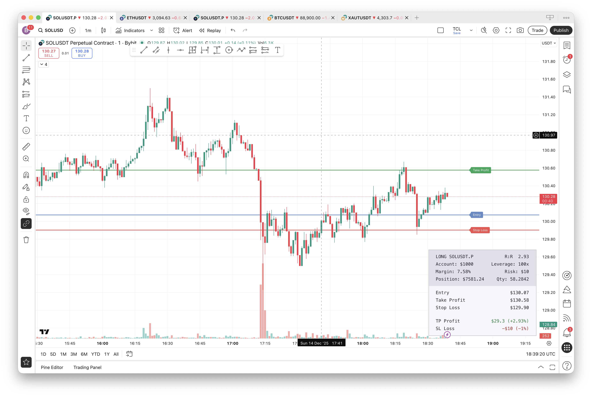

# Position Calculator for TradingView

An on chart indicator that helps you calculate position sizes, risk/reward ratios, and potential profit/loss for your trades.

## Features

- **Interactive Price Selection** - Click on the chart to set Entry, Take Profit, and Stop Loss prices
- **Automatic Position Sizing** - Calculates optimal position size based on your risk parameters
- **Risk/Reward Ratio** - Instantly see your R:R for any trade setup
- **Long & Short Support** - Automatically detects trade direction based on your TP placement
- **Leverage Support** - Accounts for leveraged trading with margin calculations
- **Flexible Risk Options** - Set risk as a percentage of account or fixed dollar amount
- **Visual Trade Lines** - Displays horizontal lines for Entry, TP, and SL on the chart
- **Dark/Light Theme** - Choose your preferred color scheme
- **Movable Info Panel** - Position the table in any corner of the chart

## Installation

1. Open TradingView and go to the Pine Script Editor
2. Copy the contents of `position-size-calc.pine`
3. Paste into the editor and click "Add to Chart"
4. Click on the chart 3 times to set your prices:
   - **1st click**: Entry price
   - **2nd click**: Take Profit price
   - **3rd click**: Stop Loss price

## Settings

### Trade Info
| Setting | Description |
|---------|-------------|
| Entry | Your entry price (click to set, drag to adjust) |
| Take Profit | Your target exit price |
| Stop Loss | Your stop loss price |

### Account Info
| Setting | Description |
|---------|-------------|
| Account Balance | Your total trading capital |
| Leverage | Trading leverage (1x for spot, higher for margin/futures) |
| Risk Type | Choose "Percentage" or "Fixed" dollar amount |
| Risk Amount | The amount you're willing to risk per trade |

### Display Settings
| Setting | Description |
|---------|-------------|
| Table Position | Corner placement (↗ ↖ ↙ ↘) |
| Theme | Dark or Light mode |
| Display Trade Lines | Toggle visibility of price lines on chart |

## Info Panel

The indicator displays a comprehensive info panel showing:

| Field | Description |
|-------|-------------|
| Direction | LONG or SHORT + ticker symbol |
| R:R | Risk to Reward ratio |
| Account | Your account balance |
| Leverage | Current leverage setting |
| Margin | Required margin as % of account |
| Risk | Your risk per trade setting |
| Position | Total position size in dollars |
| Qty | Number of units to buy/sell |
| Entry | Entry price |
| Take Profit | Target price |
| Stop Loss | Stop loss price |
| TP Profit | Potential profit in $ and % of account |
| SL Loss | Potential loss in $ and % of account |

## Example

With these settings:
- Account: $1,000
- Leverage: 10x
- Risk: 1%

If you set:
- Entry: $100
- Take Profit: $110
- Stop Loss: $95

The calculator will show:
- Position Size: $200
- Quantity: 2 units
- R:R: 2.0
- TP Profit: +$20 (+2%)
- SL Loss: -$10 (-1%)

## Version

v1.0.0

## License

This source code is subject to the terms of the Mozilla Public License 2.0.
See https://mozilla.org/MPL/2.0/ for details.
